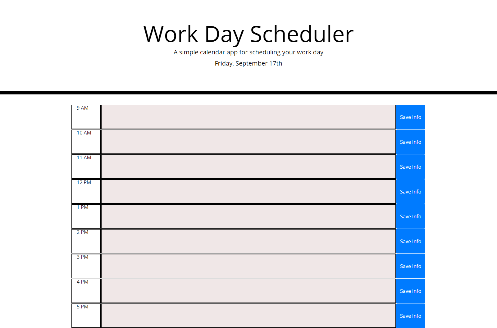

git # js-work-day-scheduler

## Work Day Scheduler 

I created a Work Day Scheduler application to assist the user with planning their workday around a standard 9-5 schedule. The user will see the current day at the top of app and have the ability to add scheduled events into the textbox to organize the user's day. These events will be stored in local storage for future needs.  The time blocks will change color based on grey for past hours, red for current hour, and green for future hours. These color changes will happen automatically through out the day.  There are still bugs and features needing to be programmed at this time.

https://github.com/Joe7web/js-work-day-scheduler

Technologies used in this application:
- HTML
- CSS
- JavaScript
- jQuery
- Bootstrap
- Moment.js

 

